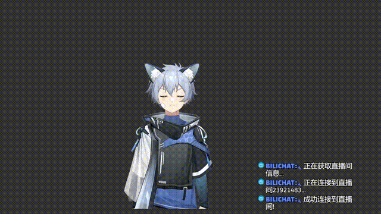
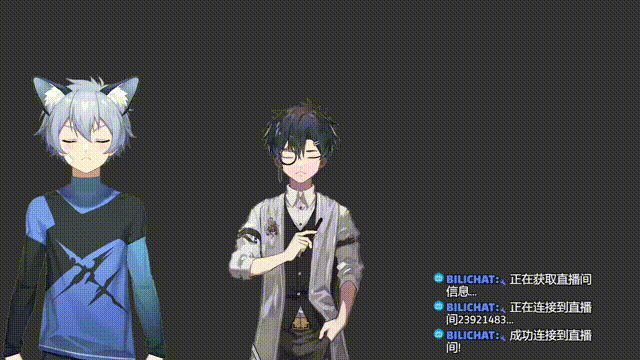

# biliVTS v0.1

在bilibili直播间使用弹幕控制l2d模型。

### 环境

使用python3.8

```
pip install -r requirements.txt
```

### 使用方法

#### 主播

* 初次使用先在VTS中启用API，然后运行`get_app_token.py`，在VTS授权后，得到`auth_key`，然后将其填入配置文件的`authenticationToken`中。
* 参考`config_template.json`和`config_example_cangyang.json`，配置好配置文件。
* 运行`danmaku_vts_controller.py`，输入配置文件路径即可运行。可控制的参数会自动从VTS读取，输出到控制台。

#### 弹幕

只需要发送如下格式的弹幕即可：

```
danmaku_id param_name target_value
```

其中`danmaku_id`是配置文件中设置的模型标识，`param_name`是控制参数名称，`target_value`是设置的参数的值。

以``config_example_cangyang.json`的设置为例，`c FaceAngleX 30`会将脸的X方向转动设置到向右的最大角度。

### Demo




